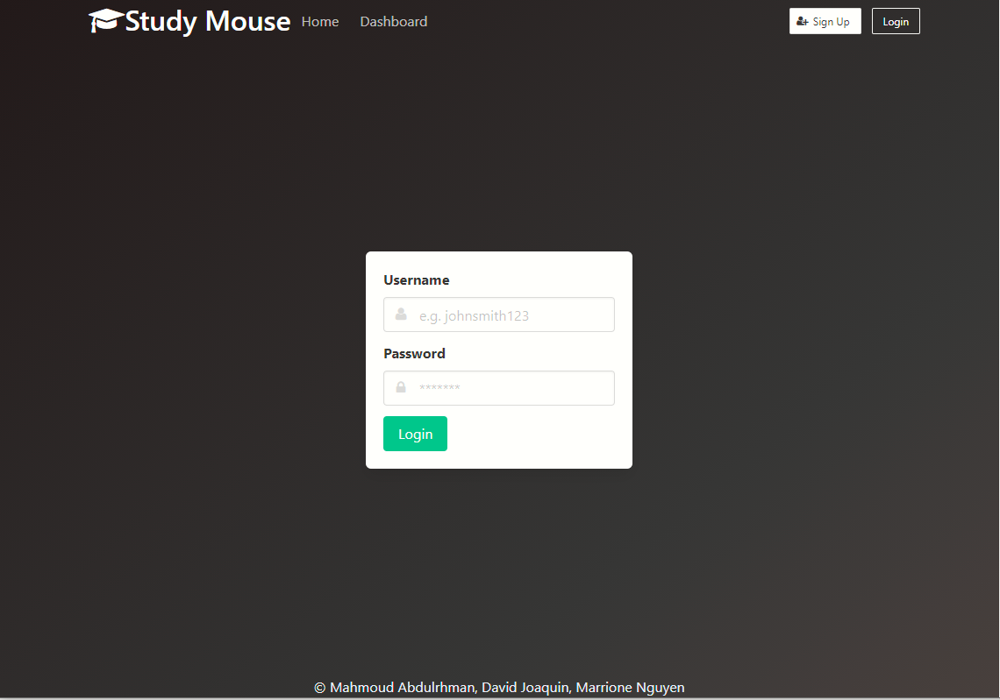
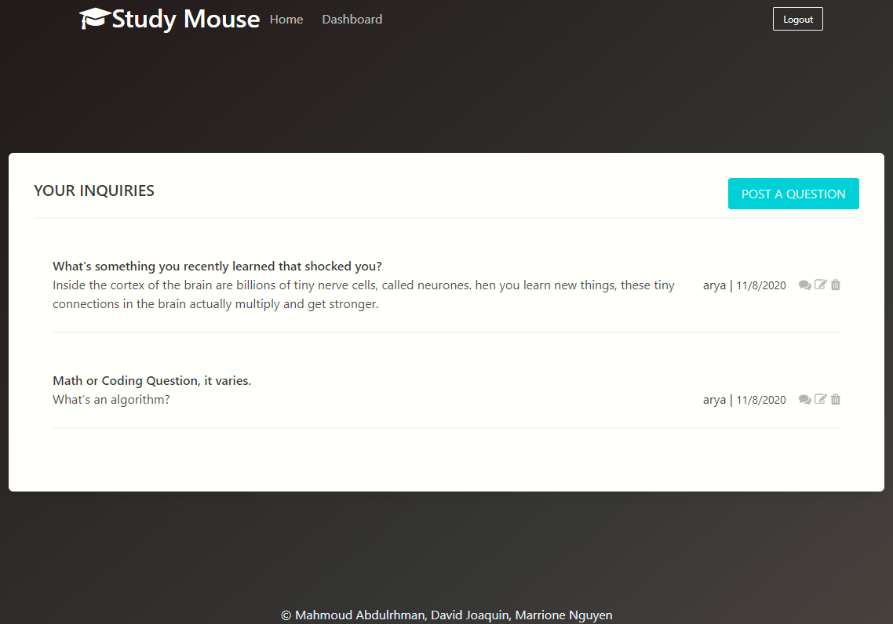

# Study Mouse
  
  
  

  ## Description 

  _Study Mouse is a collaborative online resource where users can trade highly specific information through asking questions and getting answers for them. The likes of stackoverflow and quora._
 
  ## Table of Contents

  * [Installation](#installation)
  * [Usage](#usage)
  * [Links](#links)
  * [Credits](#credits)
  * [Screenshot](#screenshot)
  * [Questions](#questions)
  
  ## Built Using

  - Javascript 1.8.5
  - CSS
  - Heroku
    - App Deployment
    - JAWSDB
      - Online Database Manager
  - Bulma
    - Styling
  - Insomnia REST Client
    - Testing API
  - Node.js
  - NPM Packages:
    - Dotenv
    - MySql
    - Sequelizer
    - Express
    - Express-session
    - Express-handlebars
    - Handlebars

  ## Installation

 - No installation required.  A link to the website is provided below.

  ## Usage 

- Visit the website: https://thawing-castle-75058.herokuapp.com/
  - Create a new user by clicking Sign Up.
  - Once account is created you are automatically logged in.
    - Compose a new question by clicking the green ``Post A Question`` button in your dashboard.
    - You may add an answer to your question or other's questions by clicking a questions ``Add Comment Icon``.
    - You may rate the answers using the star ratings.
      - Click the star that corresponds to your rating (1-5 from left to right), click and an alert will tell you the rating you chose, from there press enter.
    - You may update and delete your own question inside your own dashboard.
    - You may also check other people's question through the website feed.
    - You can check all of your questions through dashboard.

  ## Links

 - Link to Study Mouse: https://thawing-castle-75058.herokuapp.com/
 - Link to GitHub repository: https://github.com/MahmoudAbdulrhman/the-torrino-projects/

  ## Credits

- Mahmoud Abdulhrhman 
  - Controller
  - Debugging
- David Joaquin 
  - Model
  - Additional Logic
- Marrione Nguyen 
  - View
  - Additional Styling

  ## Screenshot

  ---
  ## Questions?
  _Contact Us:_
- <a href="https://github.com/MahmoudAbdulrhman">Mahmoud Abdulhrhman</a>
- <a href="https://github.com/daejo">David Joaquin</a>
- <a href="https://github.com/itsrheine">Marrione Nguyen</a>
  
