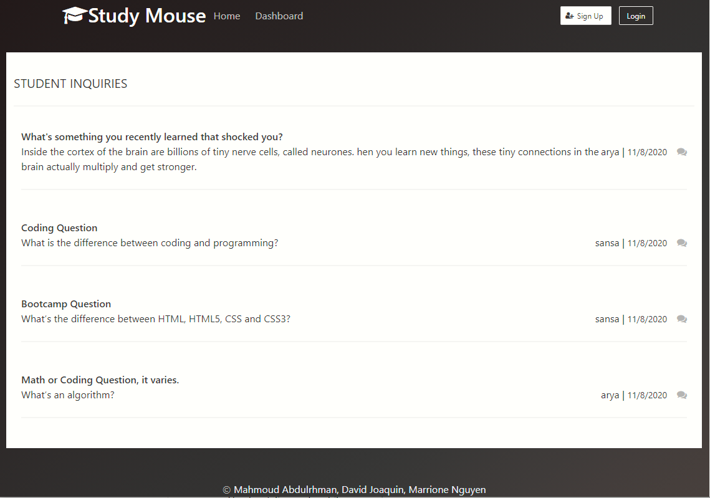

# Study Mouse
  
  
  

  ## Description 

  _Study Mouse is a collaborative online resource where users can trade highly specific information through asking questions and getting answers for them. The likes of stackoverflow and quora.__
 
  ## Table of Contents

  * [Installation](#installation)
  * [Usage](#usage)
  * [Links](#links)
  * [Credits](#credits)
  * [Screenshot](#screenshot)
  * [Questions](#questions)
  
  ## Built Using

  - Javascript
  - NPM express
  - Node.js
  - Sequelizer
  - Insomnia REST Client
  - dotenv package
  - MySql
  - Heroku
  - Bulma
  - Express
  - Express-session
  - Express-handlebars
  - Handlebars

  ## Installation

 - No installation required.  A link to the website is provided below.

  ## Usage 

- Visit the website: https://thawing-castle-75058.herokuapp.com/
- Create a new user by clicking Sign Up.
- Compose a new question by clicking "Post Question".
- You may add an answer to your post or other's post.
- You may rate the answers using the star ratings.
- You may update and delete your own post.
- You may also check the feed and your own dashboard.

  ## Links

 - Link to Study Mouse: https://thawing-castle-75058.herokuapp.com/
 - Link to GitHub repository: https://github.com/MahmoudAbdulrhman/the-torrino-projects/

  ## Credits

- Mahmoud Abdulhrhman
- David Joaquin
- Marrione Nguyen

  ## Screenshot

  ---
  ## Questions?
  _Contact Us:_
- <a href="https://github.com/MahmoudAbdulrhman">Mahmoud Abdulhrhman</a>
- <a href="https://github.com/daejo">David Joaquin</a>
- <a href="https://github.com/itsrheine">Marrione Nguyen</a>
  
